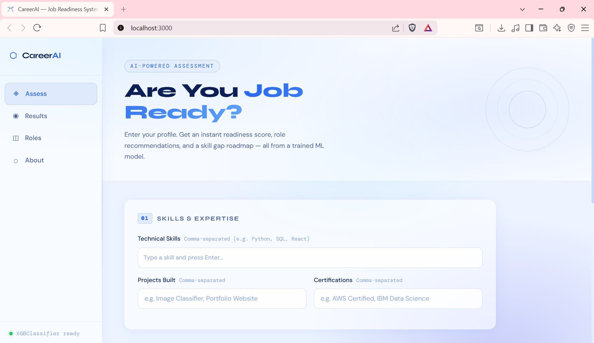
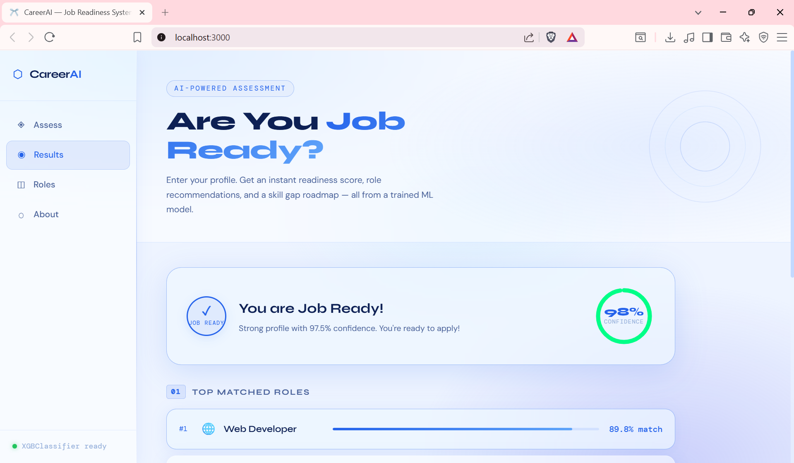
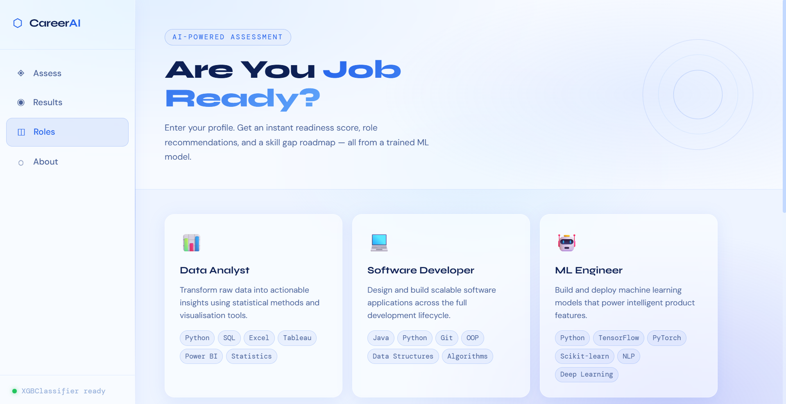

## ⭐ CareerAI — AI-Powered Job Readiness System

Your profile, intelligently evaluated.

CareerAI is a job readiness web app that analyzes user profiles, predicts readiness, recommends suitable career roles, and highlights skill gaps using a trained machine learning model.

🔗 Live: 

---

## Features

- Job readiness prediction based on profile inputs  
- Career role recommendations  
- Skill-gap analysis for selected role  
- Interactive and responsive frontend UI  
- Real-time confidence score and result cards  

---

## Tech Stack

Frontend: JavaScript, HTML, CSS, Vite  
Backend: Python, Flask  
Machine Learning: scikit-learn, XGBoost, TF-IDF, NumPy, Pandas, SciPy  
Data Visualization: Matplotlib, Seaborn  
Deployment: 

---

## Preview

  
.png)  
  
.png)  


---

## Local Setup
Terminal 1 — Backend

```bash
cd backend
pip install -r requirements.txt
python app.py
```
Runs on: http://localhost:5000

Terminal 2 — Frontend

```bash
cd frontend
npm install
npm run dev
```
Opens on: http://localhost:3000
